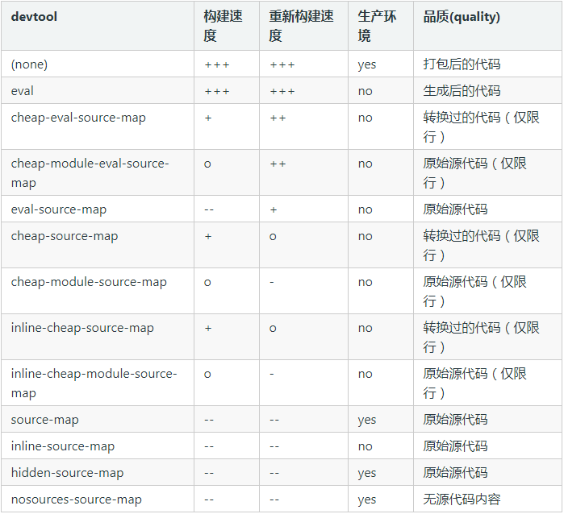

## webpack 配置

### 概念
+ module：ES和CommonJS规范中一个文件就是一个模块
+ chunk：chunk在webpack中是通过module经过一系列的拆分和合并而来。chunk和module可能存在一对一和一对多的关系。一般情况下来源有：
    * 配置的入口模块
    * 懒加载模块
    * 动态引用模块
    * 根据模块拆分规则生成和合并的模块
+ bundle：module编译之后的代码，一般和chunk一一对应，chunk进行编译打包压缩之后生成bundle。

### module.rules
module.rules 用来配置不同类型资源的解析方式

### devtool
devtool通常在开发过程需要配置，用于控制如何生成source map（source map主要用在调试过程，生成便于调试的代码）。

